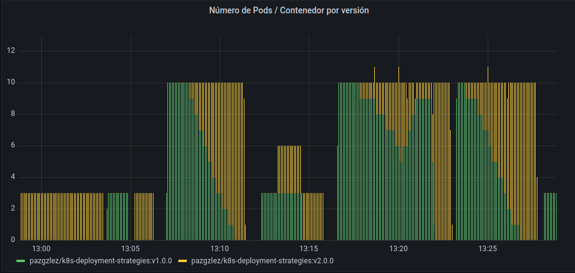

## Pulpocon2022 Estrategias de Despliegue
==========================================

> En kuberentes hay varias maneras de desplegar una aplicación, 
se debe elegir cuidadosamente la estrategia correcta para hacer que su infraestructura sea resilente.

- [recreate](recreate/): termina la version anterior y se lanza la nueva
- [rollingUpdate](rolling-update/): la nueva version se depliega lentamente en modo rolling update, una después de otra reemplazando a la anterior
- [blue/green](blue-green/): la nueva version se despliega junto con la versión anterior y luego cambiar el tráfico
- [canary](canary/): la nueva version se despliega a un subconjunto de usuarios, y gradualmente incrementamos hasta el lanzamiento completo
- A/B release: como un despliegue canary, el subconjunto está definido por **condiciones específcas**
- Shadowing: El tráfico se envía a **ambas versiones** y **la nueva versión no afecta a la respuesta**

<!---


-->


## Getting started

Instalación en local para casa:

- [Instalación infraestructura](local-kind/README.md)

---

## Taller Estrategias de despliegue / Track Devops:

La infraestructura ya está montada para el evento "PulpoCon" en un cluster de kubernetes (servicio EKS) que tenemos desplegado en AWS (Amazon Web Services)

- [Usuarios PulpoCon](https://docs.google.com/spreadsheets/d/1qm4vZoIYYcHK4AwTuHPsjFciUwVgTlFK7ENTguKx0Tk/edit?usp=sharing)
En este fichero tenemos 3 informaciones:
    - username: pulpocon-user20
    - token: <"token-k8s-pulpocon-user20">
    - kubeconfig: <"file-kube-config-pulpocon-user20">

- Las urls de trabajo son las siguientes:
    - kubernetes-dashboard: https://kubernetes-dashboard.pulpocon.gradiant.org/#/overview?namespace=pulpocon-user20
    - grafana: https://grafana.pulpocon.gradiant.org/d/6CSAiFg4k/pulpocon2022?orgId=1&var-cluster=&var-namespace=pulpocon-user20 entrar con user/pass: admin/pulp0c0n
    - pulpocon-app: https://pulpocon-user20.pulpocon.gradiant.org/

Se pueden seguir trabajando las diferentes estrategias de **un modo de configuración gráfico** por medio del kubernetes-dashboard seleccionando cada usuario su namespace de trabajo ó bien de **un modo consola** por linea de comandos en la que se recomienda tener un entorno linux para facilitar la ejecución de los comandos del repo.

- **Modo gráfico** con kubernetes-dashboard:

    - Entrar en url del kubernetes-dashboard con el token del usuario asignado:
        - kubernetes-dashboard: https://kubernetes-dashboard.pulpocon.gradiant.org/#/overview?namespace=pulpocon-user20 y meter el token <"token-k8s-pulpocon-user20"> de ese usuario descrito en fichero doc compartido de Usuarios PulpoCon para poder entrar.
    - Crear el servicio mediante el "botón +" del kubernetes-dashboard.[service](service.yaml)
    - Seguimos las instrucciones de cada estrategia ( [recreate](recreate/), [rollingUpdate](rolling-update/), [blue/green](blue-green/) y [canary](canary/) )
        - Crear el deployment de la v1 (app-v1.yaml) de las diferentes estrategias mediante el "botón +" del kubernetes-dashboard.
        - Verificar que la aplicación **"pulpocon-app"** es desplegada
        - Observar el despliegues de los pods en el mismo **"kubernetes-dashboard"** y **"grafana"**
        - Se necesita hacer un diff entre el v1 y el v2 de los diferentes deployments (diff app-v1.yaml app-v2.yaml) y editar el deployment en la sección deployments en los tres puntos del deployment y editar y poner los cambios observados y guardar.
        - Observar los cambios en la aplicación **"pulpocon-app"**, **"kubernetes-dashboard"** y **"grafana"**
        - Una vez acabada cada estrategia eliminar el deployment creado al principio.


- **Modo consola** por línea de comandos:

    - [Instalación kubectl](https://kubernetes.io/docs/tasks/tools/)
    - Utilizar el <"file-kube-config-pulpocon-user20">=kubeconfig-pulpocon-user20 que es el fichero del excell_compartido 
    ```bash
    export KUBECONFIG=kubeconfig-pulpocon-user20
    ```
    Una vez configurado el kubeconfig, seguir las instrucciones de cada estrategia con el comando kubectl, en la descripción de cada estrategia [recreate](recreate/), [rollingUpdate](rolling-update/), [blue/green](blue-green/) y [canary](canary/)

#### Flagger con nginx ingress controller - despliegue progresivo automático

- [flagger](flagger/): es un operador de entrega/despliegue progresiva para Kubernetes. 
Flagger cambia gradualmente el tráfico a la nueva versión mientras monitorea las métricas configuradas.
Puede realizar análisis y pruebas automatizados en la nueva versión, decidiendo si propagarlo a todo el clúster o detenerlo si se encuentran problemas.
Flagger aumenta lentamente la carga en la nueva versión mientras mantiene disponible la anterior, lo que garantiza un tiempo de inactividad mínimo.
Puede enviar notificaciones a Slack, Microsoft Teams y otras plataformas para notificarte a ti y a tu equipo sobre los eventos ocurridos.

#### Diagarama comparativo entre estartegias


#### Example graph

Recreate:


RollingUpdate:


Blue/Green:


Canary:


#### Bibliography

Checkout the following resources:
- [GitHub CNCF strategies-deployment](https://github.com/ContainerSolutions/k8s-deployment-strategies)
- [CNCF presentation](https://www.youtube.com/watch?v=1oPhfKye5Pg)
- [CNCF presentation slides](https://www.slideshare.net/EtienneTremel/kubernetes-deployment-strategies-cncf-webinar)
- [Kubernetes deployment strategies](https://container-solutions.com/kubernetes-deployment-strategies/)
- [Six Strategies for Application Deployment](https://thenewstack.io/deployment-strategies/).
- [Canary deployment using Istio and Helm](https://github.com/etiennetremel/istio-cross-namespace-canary-release-demo)
- [Automated rollback of Helm releases based on logs or metrics](https://container-solutions.com/automated-rollback-helm-releases-based-logs-metrics/)
- [Canary deployments with Flagger](https://www.weave.works/blog/kubernetes-deployment-strategies)
- [Flagger NGINX Canary Deployments](https://devopstales.github.io/kubernetes/flagger-nginx-canary-deployments/)
- [Progressively Deliver Releases Using Flagger](https://www.digitalocean.com/community/tutorials/how-to-progressively-deliver-releases-using-flagger-on-digitalocean-kubernetes)
