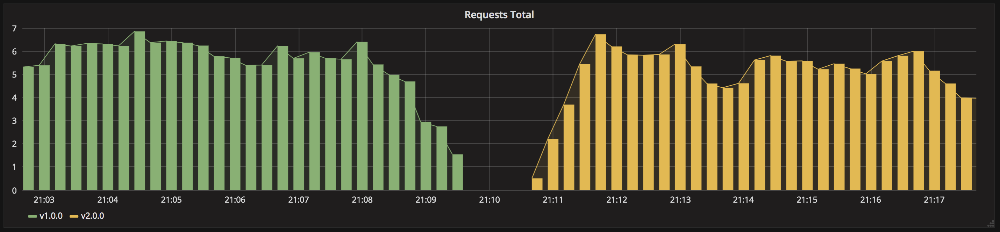

Recreate despliegue
===================

> Version A termina entonces la version B es deplegada.



La estrategia recreate es un dummy deployment que consiste en parar la versión A e implementar la versión B después de que se para y elimina la versión A. Esta técnica implica downtime del servicio que depende de las duraciones del shutdown (apagado) y del boot (arranque) de la aplicación. 

## Pasos a seguir

1. version 1 está disponible
1. eliminar version 1
1. desplegar version 2
1. esperar hasta que todas las réplicas estén listas

## En la práctica

```
# Deploy the first application
$ kubectl apply -f deployment611.yaml

# Test if the deployment was successful
$ curl $(minikube service frontend-podinfo --url)
2018-01-28T00:22:04+01:00 - Host: host-1, Version: v1.0.0

# To see the deployment in action, open a new terminal and run the following
# command
$ watch kubectl get pods

# Then deploy version 2 of the application
$ kubectl apply -f deployment612.yaml

# Test the second deployment progress
$ service=$(minikube service frontend-podinfo --url)
$ while sleep 0.1; do curl "$service"; done
```

### Cleanup

```bash
$ kubectl delete -f deployment612.yam
```
#$ kubectl delete all -l app=frontend-podinfo