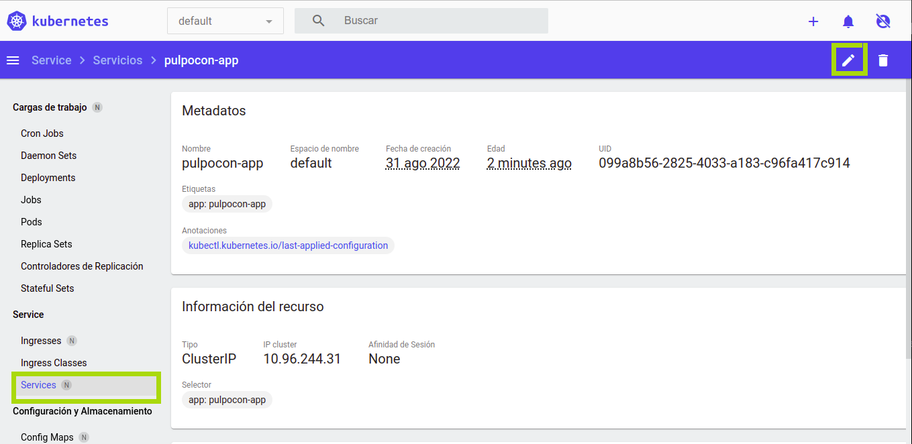

Blue/green deployment para un único servicio
=====================

> La version B se despliega con la version A, entonces el tráfico de la version A se cambia a la versión B. Se conoce también como red/black deployment.


La estrategia blue/green se diferencia de la de rollingUpdate, ya que la versión B (verde) se implementa junto con la versión A (azul) con la misma cantidad de instancias. 
Después de probar que la nueva versión es correcta, el tráfico se cambia de la A a la B a nivel de balanceador de carga.

> En este ejemplo, desplegamos una nueva versión de un único servicio usando la estrategia de blue/green.

## Pasos a seguir

1. version 1 está sirviendo tráfico.
1. desplegamos version 2.
1. esperamos hasta que version 2 esté disponible.
1. cambiamos el tráfico entrante de la versión 1 a la versión 2.
1. paramos version 1.

## En línea de comandos

```bash
# We can left ready the service sending the traffic only for the first version (blue) by patching
# the service to send traffic to all pods with label version=v1.0.0
kubectl get svc pulpocon-app -o yaml
kubectl patch service pulpocon-app -p '{"spec":{"selector":{"version":"v1.0.0"}}}'
kubectl get svc pulpocon-app -o yaml

# Deploy the first application option blue
kubectl apply -f app-v1-blue.yaml

# Test if the deployment was successful
curl pulpocon-app.fbi.com
curl -k https://pulpocon-user20.pulpocon.gradiant.org

# To see the deployment in action, open a new terminal and run the following command.
watch kubectl get pods

# Then deploy version 2 of the application option green
kubectl apply -f app-v2-green.yaml

# Wait for all the version 2 pods to be running
kubectl rollout status deploy pulpocon-app-v2 -w

# Side by side, 3 pods are running with version 2 but the service still send
# traffic to the first deployment.

# If necessary, you can manually test one of the pod by port-forwarding it to
# your local environment.

# Once your are ready, you can switch the traffic to the new version (green) by patching
# the service to send traffic to all pods with label version=v2.0.0
kubectl patch service pulpocon-app -p '{"spec":{"selector":{"version":"v2.0.0"}}}'

# Test if the second deployment was successful
while sleep 0.1; do curl "pulpocon-app.fbi.com"; done
while sleep 0.1; do curl -k "https://pulpocon-user20.pulpocon.gradiant.org"; done

# In case you need to rollback to the previous version
kubectl patch service pulpocon-app -p '{"spec":{"selector":{"version":"v1.0.0"}}}'

# If everything is working as expected, you can then delete the v1.0.0
# deployment
kubectl delete deploy pulpocon-app-v1

# Cleanup

kubectl delete deploy -l app=pulpocon-app

# Patch the service and left for the rest deployment strategies with only selector "app: pulpocon-app"
kubectl patch service pulpocon-app --type=json -p='[{"op": "remove", "path": "/spec/selector/version"}]'
kubectl get svc pulpocon-app -o yaml
```

## En Modo Gráfico

Primero editaremos el servicio `pulpocon-app` para que envíe el tráfico solo a la primera version que desplegaremos (blue).



Añadimos el siguiente campo:

- spec.selector.version: v1.0.0

A continuación creamos un nuevo recurso a partir del fichero [app-v1-blue.yaml](app-v1-blue.yaml):


Observa el estado del despliegue en el [kubernetes-dashboard](https://kubernetes-dashboard.pulpocon.gradiant.org) y en [grafana](https://grafana.pulpocon.gradiant.org).

Accede a la aplicación en la url https://pulpocon-userX.pulpocon.gradiant.org (indica tu usuario concreto) y observa que instancia y versión te contesta.

A continuación, siguiendo la estrategia blue-green, desplegamos en paralelo la version 2. Para ello creamos un nuevo recurso a partir del fichero [app-v2-green.yaml](app-v2-green.yaml):

Observa los recursos desplegados en el [kubernetes-dashboard](https://kubernetes-dashboard.pulpocon.gradiant.org) y en [grafana](https://grafana.pulpocon.gradiant.org).

Comprueba que el servicio solo redirige las peticiones a la version 1 en la url de la aplicacion.

Ahora movemos el tráfico de la versión 1 a la versión 2. Para ello editamos de nuevo el servicio y cambiamos el campo `spec.selector.version: v2.0.0`.

Comprueba que el servicio solo redirige las peticiones a la version 2 en la url de la aplicacion.

En caso de necesitar volver a la versión anterior podemos volver a editar el servicio.

Si consideramos que la version 2 funciona correctamente podemos proceder a borrar la version 1.


Borra el despliegue blue y green antes de pasar a la siguiente estrategia.


**Se puede aplicar el despliegue blue/green para un único servicio o para varios servicios usando un Ingress controller:**

**You can apply the blue/green deployment technique for a single service or
multiple services using an Ingress controller:**

- [multiple services using Ingress](https://github.com/ContainerSolutions/k8s-deployment-strategies/tree/master/blue-green/multiple-services)
