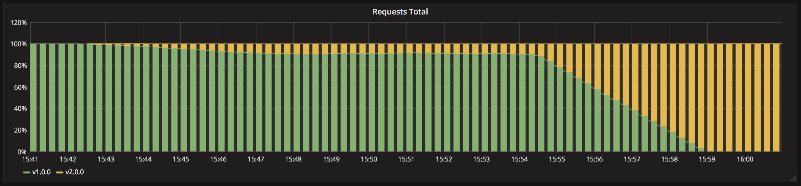

Canary deployment con funcionalidades de k8s nativas
=================

> La version B se depliega a un subconjunto de usuarios, y posteriormente se procede al despliegue completo.



Un despliegue canary consiste en cambiar gradualmente el tráfico de la version A a la versión B. 
Normalmente el tráfico se divide en función del peso, ej. 90% de las peticiones van a la versión A y 10% a la B.

Esta técnica se usa principalmente cuando faltan pruebas o no son fiables o hay poca confianza en la estabilidad de la nueva versión en la plataforma.

Para nuestro caso usamos configuración y reparo de réplicas. 

## Pasos a seguir

1. 10 replicas de la version 1 sirven tráfico
1. Desplegamos 1 replica de version 2 (10% del tráfico)
1. Esperamos hasta que la version 2 sea estable y no tenga errores inesperados
1. Escalamos la version 2 a 10 replicas
1. Esperamos que las instancias estén listas
1. Paramos la version 1

### En línea de comandos

```bash
# Deploy the first application
kubectl apply -f app-v1.yaml

# Test if the deployment was successful
curl pulpocon-app.fbi.com
curl -k https://pulpocon-user20.pulpocon.gradiant.org

# To see the deployment in action, open a new terminal and run a watch command.
# It will show you a better view on the progress
watch kubectl get pods

# Then deploy version 2 of the application and scale down version 1 to 9 replicas at same time
kubectl apply -f app-v2.yaml
kubectl scale --replicas=9 deploy pulpocon-app-v1

# Only one pod with the new version should be running.
# You can test if the second deployment was successful
while sleep 0.1; do curl "pulpocon-app.fbi.com"; done
while sleep 0.1; do curl -k "https://pulpocon-user20.pulpocon.gradiant.org"; done

kubectl scale --replicas=2 deploy pulpocon-app-v2
kubectl scale --replicas=8 deploy pulpocon-app-v1

...

kubectl scale --replicas=9 deploy pulpocon-app-v2
kubectl scale --replicas=1 deploy pulpocon-app-v1

# If you are happy with it, scale up the version 2 to 10 replicas
# Then, when all pods are running, you can safely delete the old deployment
kubectl scale --replicas=10 deploy pulpocon-app-v2
kubectl delete deploy pulpocon-app-v1

# cleanup
kubectl delete deploy -l app=pulpocon-app

```
### En Modo Gráfico

Crea un nuevo recurso a partir del fichero [app-v1.yaml](app-v1.yaml):


Observa el estado del despliegue en el [kubernetes-dashboard](https://kubernetes-dashboard.pulpocon.gradiant.org) y en [grafana](https://grafana.pulpocon.gradiant.org).


Accede a la aplicación en la url https://pulpocon-userX.pulpocon.gradiant.org (indica tu usuario concreto) y observa que instancia y versión te contesta.

Despliega en paralelo la version 2 mediante la estrategia canary.

Para ello crea un nuevo recurso a partir del fichero [app-v2.yaml](app-v2.yaml).

Observa la coexistencia de ambas versiones.

Edita los Deployment `pulpocon-app-v1` y `pulpocon-app-v2` para escalar su número de instancias:


1- cambia los siguientes campos `pulpocon-app-v1`:

 - spec.replicas: 9

2- cambia los siguientes campos `pulpocon-app-v2`:

 - spec.replicas: 1

En la estrategia canary iriamos progresivamente incrementando las replicas de `pulpocon-app-v2` y disminuyendo las de `pulpocon-app-v1` repitiendo el paso anterior.

Borra el despliegue antes de pasar a la siguiente estrategia.


**Se puede implementar de forma nativa ajustando el número de réplicas o podemos usar un Nginx como Controlador de Ingress de entrada y se puede configurar la división del trafico más fino a través de anotaciones de Ingress (nginx.ingress.kubernetes.io/canary: "true" and nginx.ingress.kubernetes.io/canary-weight: "10"**

## Bibliography

- [nginx-ingress] (https://github.com/ContainerSolutions/k8s-deployment-strategies/tree/master/canary/nginx-ingress)

- [Istio] (https://github.com/ContainerSolutions/k8s-deployment-strategies/tree/master/canary/istio)

- [Istio-and-Helm] (https://github.com/etiennetremel/istio-cross-namespace-canary-release-demo)

*If you use Helm to deploy applications, the following repository demonstrate how to make a [canary deployment using Istio and
Helm](https://github.com/etiennetremel/istio-cross-namespace-canary-release-demo).*
