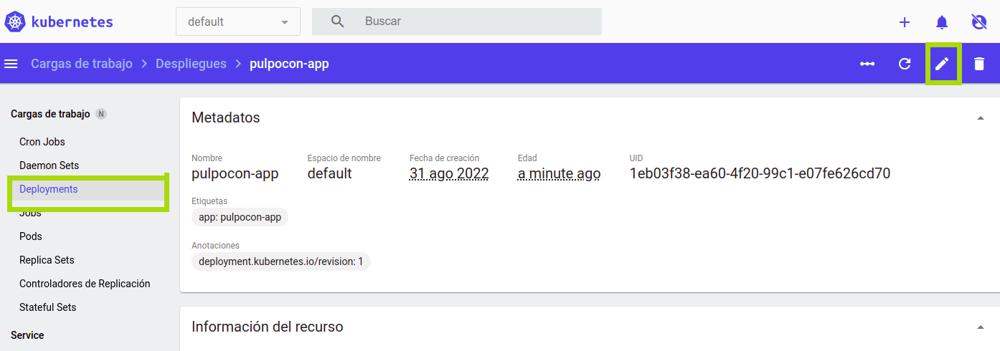

Recreate despliegue
===================

> La version A se termina y entonces se despliega la version B.


La estrategia recreate es un _dummy deployment_ que consiste en parar la versión A e implementar la versión B una vez que se para y elimina la versión A. Esta técnica *implica downtime del servicio*, el cual depende de las duraciones del _shutdown_ (apagado) y del _boot_ (arranque) de la aplicación. 

## Pasos a seguir

1. version 1 está disponible
1. eliminar version 1
1. desplegar version 2
1. esperar hasta que todas las réplicas estén listas

## En línea de comandos

```bash
# Deploy the first application
kubectl apply -f app-v1.yaml

# Test if the deployment was successful
curl pulpocon-app.fbi.com
curl -k https://pulpocon-user20.pulpocon.gradiant.org

# To see the deployment in action, open a new terminal and run the following command.
watch kubectl get pods

# Then deploy version 2 of the application
kubectl apply -f app-v2.yaml

# Test the second deployment progress
while sleep 0.1; do curl "pulpocon-app.fbi.com"; done
while sleep 0.1; do curl -k "https://pulpocon-user20.pulpocon.gradiant.org"; done

# Clean Up
kubectl delete deploy -l app=pulpocon-app

```

## En Modo Gráfico

Crea un nuevo recurso a partir del fichero [app-v1.yaml](app-v1.yaml):


Observa el estado del despliegue en el [kubernetes-dashboard](https://kubernetes-dashboard.pulpocon.gradiant.org) y en [grafana](https://grafana.pulpocon.gradiant.org).

Accede a la aplicación en la url https://pulpocon-userX.pulpocon.gradiant.org (indica tu usuario concreto) y observa que instancia y versión te contesta.

Edita el despliegue para actualizar su versión.



Para ello cambia los siguientes campos:

 - spec.template.metadata.labels.version: v2.0.0
 - spec.template.spec.containers[0].image: pazgzlez/k8s-deployment-strategies:v2.0.0

Observa el estado del despliegue en el [kubernetes-dashboard](https://kubernetes-dashboard.pulpocon.gradiant.org) y en [grafana](https://grafana.pulpocon.gradiant.org).

Borra el despliegue antes de pasar a la siguiente estrategia.


