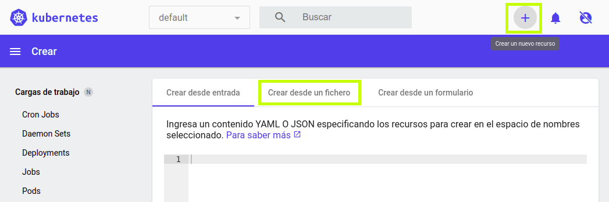
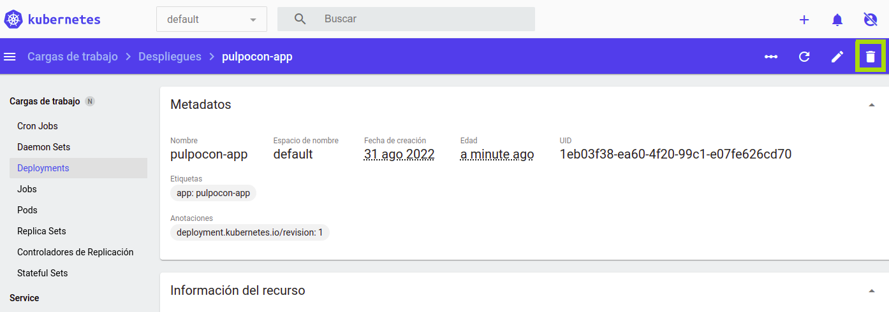

RollingUpdate deployment
========================

> La version B se implementa lentamente y va reemplazando a la version A. También conocido como ramped o incremental.


La estrategia _rollingUpdate_ consiste en desplegar lentamente una version de una aplicación reemplazando
las instancias una tras otra hasta que todas las instancias son desplegadas.
Normalmete sigue el siguiente proceso: con un pool de version A detras de un loadBalancer, se despliega una instancia de versión B. Cuando el servicio está listo para aceptar tráfico, la instancia es añadida al pool. 
Entonces se elimina una instancia de la versión A del pool y se cierra.

Despendiendo del sistema que se encarge de este rollingUpdate, se pueden configurar los siguientes parámetros 
para aumentar el tiempo de despliegue:

- Paralelismo, *max batch size*: Número de instancias concurrentes para desplegar.
- *Max surge*: Número de instancias a agregar además de la cantidad actual.
- *Max unavailable*: Número de instancias no disponibles permitidas en el proceso de rollingUpdate.

## Pasos a seguir

1. version 1 está disponible
1. desplegar version 2
1. esperar hasta que todas las réplicas sean reemplazadas con version 2

## En línea de comandos

```bash
# Deploy the first application
kubectl apply -f app-v1.yaml

# Test if the deployment was successful
curl pulpocon-app.fbi.com
curl -k https://pulpocon-user20.pulpocon.gradiant.org

# To see the deployment in action, open a new terminal and run the following
# command
watch kubectl get pods

# Then deploy version 2 of the application
kubectl apply -f app-v2.yaml

while sleep 0.1; do curl "pulpocon-app.fbi.com"; done
while sleep 0.1; do curl -k "https://pulpocon-user20.pulpocon.gradiant.org"; done

# In case you discover some issue with the new version, you can undo the
# rollout
kubectl rollout undo deploy pulpocon-app

# If you can also pause the rollout if you want to run the application for a
# subset of users
kubectl rollout pause deploy pulpocon-app

# Then if you are satisfy with the result, rollout
kubectl rollout resume deploy pulpocon-app

# Cleanup
kubectl delete deploy -l app=pulpocon-app
```

## En Modo Gráfico

Crea un nuevo recurso a partir del fichero [app-v1.yaml](app-v1.yaml):



Observa el estado del despliegue en el [kubernetes-dashboard](https://kubernetes-dashboard.pulpocon.gradiant.org) y en [grafana](https://grafana.pulpocon.gradiant.org).


Accede a la aplicación en la url https://pulpocon-userX.pulpocon.gradiant.org (indica tu usuario concreto) y observa que instancia y versión te contesta.

Edita el despliegue para actualizar su versión y cambiar su estrategia de despliegue.


Para ello cambia los siguientes campos:

 - spec.template.metadata.labels.version: v2.0.0
 - spec.template.spec.containers[0].image: pazgzlez/k8s-deployment-strategies:v2.0.0

Y descomenta la sección spec.strategy:

```
...
   strategy:
     type: RollingUpdate
     rollingUpdate:
       maxSurge: 1
       maxUnavailable: 0
...
```

Observa el estado del despliegue en el [kubernetes-dashboard](https://kubernetes-dashboard.pulpocon.gradiant.org) y en [grafana](https://grafana.pulpocon.gradiant.org).

Borra el despliegue antes de pasar a la siguiente estrategia.

